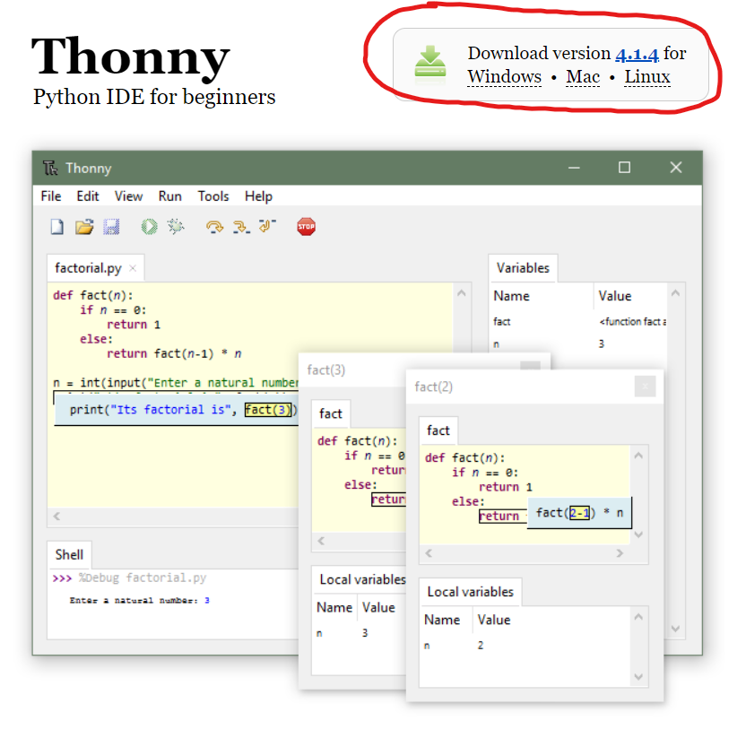

# Sommaire

- [Sommaire](#sommaire)
- [0. Prérequis](#0-prérequis)
- [1. Installer Python](#1-installer-python)
- [2. Installer Thonny IDE](#2-installer-thonny-ide)
- [3. Programmer en Python avec Thonny](#3-programmer-en-python-avec-thonny)
- [4. Programmer en C++ avec Arduino IDE](#4-programmer-en-c-avec-arduino-ide)
- [4. organisation du code](#4-organisation-du-code)
  - [4.1 Le dossier Cam contient le code de la vision par ordinance](#41-le-dossier-cam-contient-le-code-de-la-vision-par-ordinance)
  - [4.2 Le dossier ESP32CapteursActionneurs pour le code de l'ESP32](#42-le-dossier-esp32capteursactionneurs-pour-le-code-de-lesp32)
  - [4.3 Le dossier ESP32UART](#43-le-dossier-esp32uart)
  - [4.4 Le dossier QrCodeWriter](#44-le-dossier-qrcodewriter)


## 0. Prérequis

⚠️Avant de lire ce manuel vous devez vous assurer d'avoir au préalable lu : 
- Le manuel de mécanique et avoir monté le robot
- Le manuel d'électronique et avoir vérifié tout le montage électronique

Si vous n'avez pas réalisé ces étapes, vous risquez de ne pas pouvoir implémenter le code.

## 1. Installer Python 


## 2. Installer Thonny IDE

- Allez sur ce site : [https://thonny.org](https://thonny.org)
- Téléchargez le fichier executable en accord de votre système d'exploitation. Choisir la version recommandée 
    - Lancer l'executable téléchargé et suivre les instructions d'installation

- Puis ouvrez Thonny IDE et installez les packages pyhton suivants:

> pip install -r requirements.txt

## 3. Programmer en Python avec Thonny

- Ouvrez Thonny IDE
- Ouvrez le fichier `.py` dans le dossier `Code` du dépot git
- Cliquez sur `Run` pour exécuter le code

## 4. Programmer en C++ avec Arduino IDE

Pour programmer en C++, il est nécessaire d'installer Arduino IDE qui permet de compiler et d'uploader des programmes sur des cartes Arduino.
Si vous avez un Arduino à votre disposition, vous pouvez suivre ce tutoriel pour installer [Arduino IDE](https://www.arduino.cc/en/Guide) : 

pour programmer l'ESP32, il est nécessaire d'installer les drivers pour l'ESP32, vous pouvez suivre ce tutoriel pour [installer](https://randomnerdtutorials.com/installing-the-esp32-board-in-arduino-ide-windows-instructions/) les drivers : 
 
## 4. organisation du code

```
.
├── cam
│   ├── Cam.ino
│   ├── images_test_vision
│   │   ├── blue.png
│   │   ├── cozmo.png
│   │   ├── green.png
│   │   ├── it works.png
│   │   ├── red.png
│   │   └── test.png
│   └── WebCamVision.py
├── ESP32Actionneur
│   ├── infraredSensor.py
│   ├── LedMatrixConst.py
│   ├── ledMatrix.py
│   ├── main.py
│   ├── max7219.py
│   ├── motor.py
│   └── servoMotor.py
├── ESP32Link
│   └── link.py
├── Images
│   └── Thonny_Download.png
├── Manual-Programmation.md
├── Manuel_utilisateur.md
├── pyCam
│   ├── boot.py
│   ├── main.py
│   └── pymakr.conf
├── Qrcode_Writer
│   └── QrCodeWriter.py
├── README.md
└── requirements.txt
```

### 4.1 Le dossier Cam contient le code de la vision par ordinance
- `Cam.ino` : code arduino pour tester l'esp cam
    - ce code est en cours de développement et n'est pas encore fonctionnel
- `WebCamVision.py` : code python pour la vision par ordinance, qui utilise OpenCV et la webcam d'un ordinateur 
- Le dossier `images_test_vision` contient des images pour tester la vision par ordinance

### 4.2 Le dossier ESP32CapteursActionneurs pour le code de l'ESP32

cette partie contient le code pour les capteurs et les actionneurs de l'ESP32 qui ont été utilisés dans le robot

- `infraredSensor.py` : code python pour le capteur infrarouge
- `LedMatrixConst.py` : code python pour les constantes de la matrice de LED
- `ledMatrix.py` : code python pour la matrice de LED
- `main.py` : code python principal pour l'ESP32
- `max7219.py` : code python pour la matrice de LED
- `motor.py` : code python pour les moteurs
- `servoMotor.py` : code python pour les servomoteurs

### 4.3 Le dossier ESP32UART 

- UART.py : code python pour la communication UART entre les ESP32
    - ce code est en cours de développement et n'est pas encore fonctionnel

### 4.4 Le dossier QrCodeWriter

- QrCodeWriter.py : code python pour générer des QR codes
    - pour générer le code QR, il suffit de lancer le code python avec l'argument -m suivi du message a encoder ex: ```python QrCodeWriter.py -m "Hello World"```
