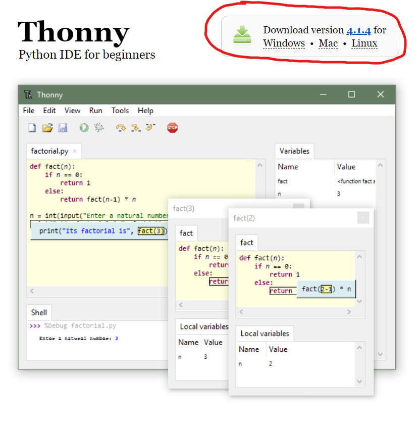

# Manuel d'implémentation - Code

## Introduction

Ce manuel a pour objectif d'accompagner l'utilisateur dans l'implémentation et l'utilisation du code présent sur ce dépot gitlab dans le robot présent.  
    
⚠️Avant de lire ce manuel vous devez vous assurer d'avoir au préalable lu : 
- Le manuel de mécanique et avoir monté le robot
- Le manuel d'électronique et avoir vérifié tout le montage électronique
   

Si vous n'avez pas réalisé ces étapes, vous risquez de ne pas pouvoir implémenter le code. 

## Implémentation

### I. Installation des logiciels et langages de programmation

 - Installation de Thonny IDE :   
    1. Allez sur ce site : [https://thonny.org](https://thonny.org)
    2. Téléchargez le fichier executable en accord de votre système d'exploitation. Choisir la version recommandée 
    3. Lancer l'executable téléchargé et

